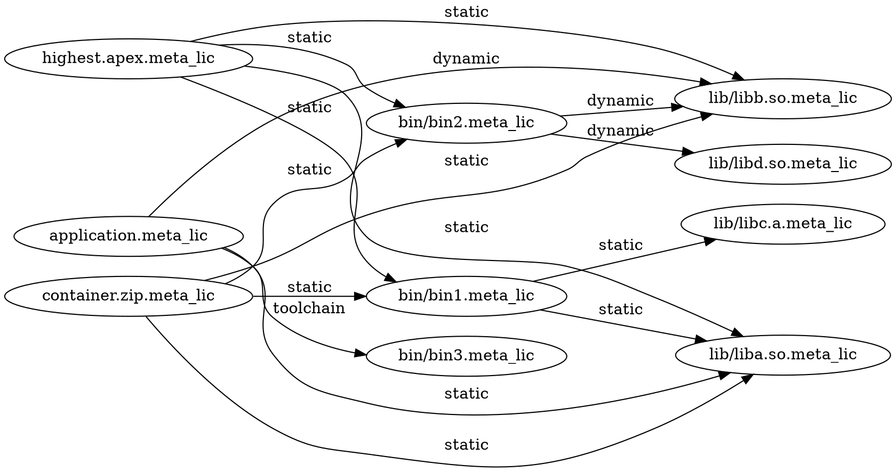
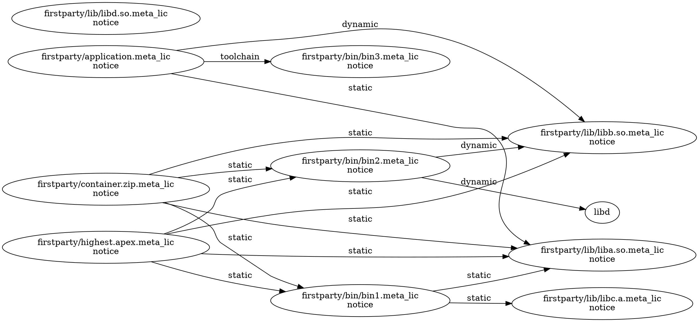
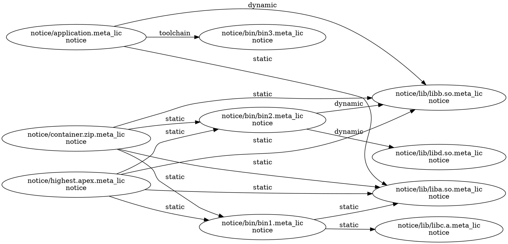
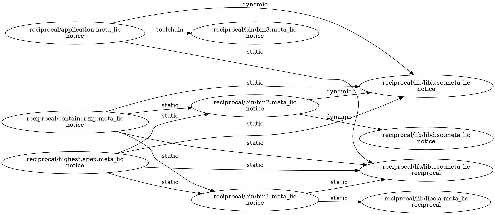
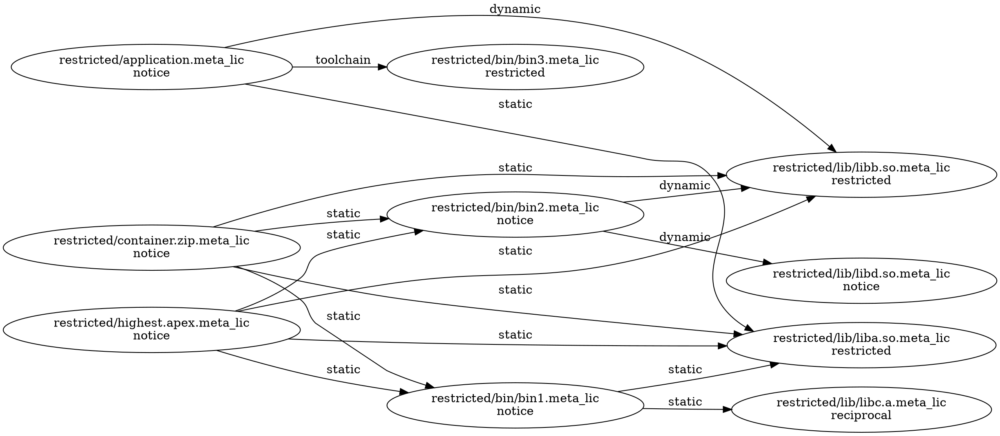
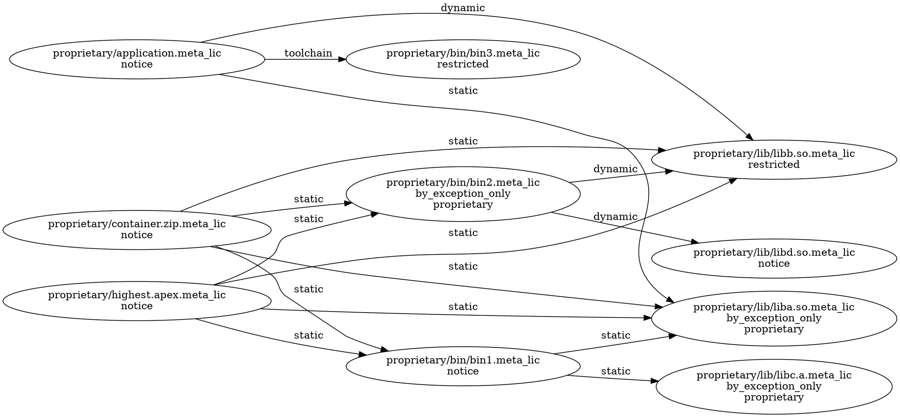

## Test data

Each directory under testdata/ defines a similar build graph.
All have the same structure, but different versions of the graph have different
license metadata.

### Testdata build graph structure:

The structure is meant to simulate some common scenarios:

*   a `lib/` directory with some libraries
*   a `bin/` directory with some executables
*   one of the binaries, `bin3`, is a toolchain executable like a compiler
*   an `application` built with the `bin3` compiler and linking a couple libraries
*   a pure aggregation `continer.zip` that merely bundles files together, and
*   an apex file (more like an apk file) with some binaries and libraries.

The testdata starts with a `firstparty/` version with only first-party
licenses, and each subsequent directory introduces more restrictive conditions:

*   `notice/` starts with `firstparty/` adds third-party notice conditions
*   `reciprocal/` starts with `notice/` and adds some reciprocal conditions
*   `restricted/` starts with `reciprocal/` and adds some restricted conditions
*   `proprietary/` starts with `restricted/` and add some privacy conditions

### firstparty/ testdata starts with all first-party licensing

### notice/ testdata introduces third-party notice conditions

### reciprocal/ testdata introduces third-party reciprocal sharing conditions

### restricted/ testdata introduces restricted source sharing conditions

### proprietary/ testdata introduces privacy conditions

